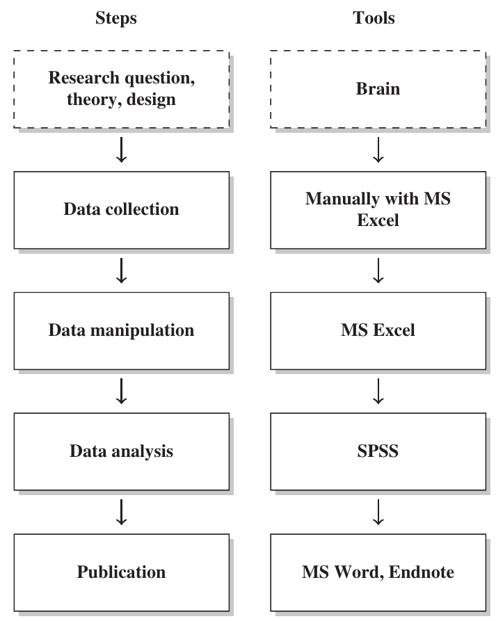
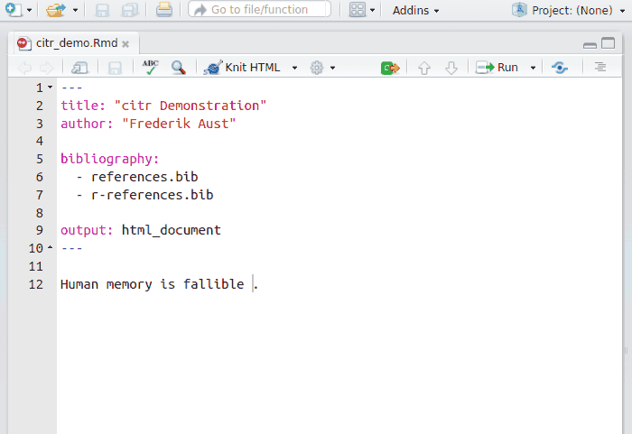

---
output:
  pdf_document: default
  html_document: default
---
## Introduction

Authoring is a common task for all scholars and students in academia, from report preparation, teaching, journal submission to book writing. Yet many people in academia aren't familiar with using specialized tools and an integrated workflow for academic writing, especially in the fields of Social science.

Academic writing takes a great deal of time. However, much of the time spent *isn't realated to the content or the idea the author wishes to convey* but the chores regarding repetive works such as manually combining results from differnt analysis tools or formatting the papers to suit the requirements of journals.
A great deal of time can be saved if there exists a recommended and integrated workflow for academic writing, either as a norm or a culture that encourages this. Currently, however, workflows for academic writing are a matter of tastes for different authors and are considered as personal skills.
It should be argued that a workflow be proposed in a specific field of science, especially in the fields of Social science, where students often have no formal programming training to  allow themselves to build custom programs that facilitate an integrated workflow.

An integrated workflow for academic writing is crucial in science. An example of a common, but not integrated, workflow is illustrated below:

(ref:caption-badflow) A common but not integrated workflow [@munzert2014, pp xviii].

```{r out.width="40%" ,fig.cap="(ref:caption-badflow)"}

```

One of the problem of this workflow is that authors have to manually copy-and-paste results from different sources, which are error-prone, and when errors are found, authors have to go through the process again, wasting a substantial time.
An even more serious problem related to this workflow is that it might hinder the progress of science, since when errors occured but are not found, erroneous results enter a published paper, in which subsequent researches would base on.

Facilitating an integrated workflow for acedemic writing is related to specific tasks a field often does. Hence, no preexisting tools exist. However, general frameworks exist and are extendable and customizable to fit in specific needs of a field. This article surveys the R Markdown ecosystem, and focuses perticularly on features related to Linguistics in order to propose a integrated workflow for authoring.


```{r}
if (is_html_output()) 
```

```{r fig.show='hold', include=FALSE, out.width=c("43.5%", "56.5%")}
if (is_latex_output()) include_graphics(c("figs/citr2.png", "figs/citr0.png"))
```


