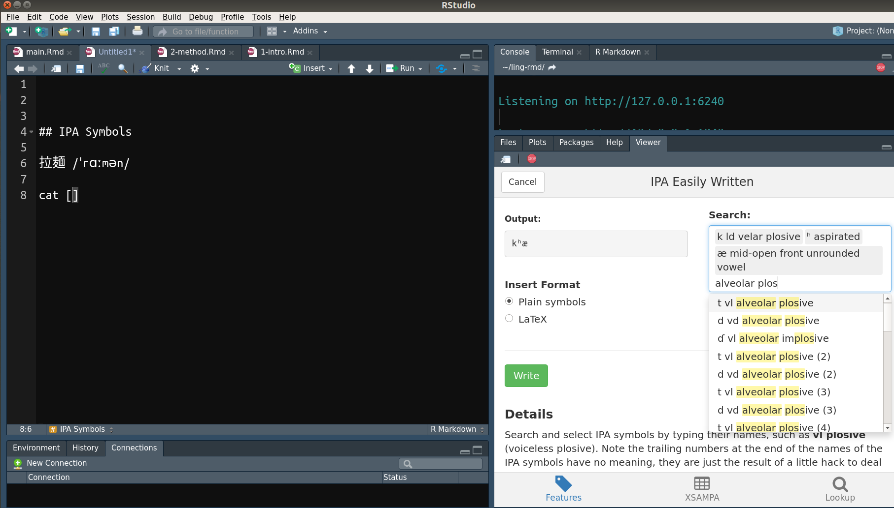

# Overview of R Markdown

## A Brief Introduction

"Markdown" is a minimalist and easy-to-learn markup language[^markup], which formats the text by using plain text markers, e.g., lines beginning with "#" are first level titles and "##" are second level titles, wrapping text with "\*" results in italics, etc. "R Markdown" extends the syntax of Markdown to allow more versatile styling of the text and therefore allows authoring documents with publication-ready qualities.

## Benefits of Using R Markdown

There are several benefits for using R Markdown as an authoring tool. Most of them results directly from the extensibilty of R, the language R Markdown bases on.

### R

R is a programming language developed not in a traditional CS[^cs]-context but for the purpose of statistical computing [@rcoreteam2018]. This makes R a special language -- althought R has a steep learning curve compared to other GUI-based statistical softwares, it has a gentle learning curve compared to other "hardcore" programming languages. R is designed for scientists, not programmers.
In addition, there is a huge and friendly community support for R, which means solutions to many problems new users often confront can easily be found on the web.

Many fields other than statistics either start to or already use R substantially, such as Biostatistics and Bioinformatics, Ecology and Evolution, Finance, Psychometrics, Geospatial analysis, and even Linguitics [@cran2018a]. This is due to R's great extendibility, with more than 13,000 packages hosted on @cran2018. As noted later, this extandibility also enables turning R Markdown into a specialized tool for authoring in Linguistics.

By integration with R language, R Markdown allows computed results be directly embedded into the document.
To put it another way, the analysis of data (through R) is directly integrated into document writing, and hence, errors incured by manual copy-and-pasting are eliminated. This also enhance the *reproduciblity* of the workflow [@baumer2014], since every time the document is generated from R Markdown, the underlying code for data analysis is rerun to generate the embedded output. Generating the document is essentially reproducing the analysis of data.

### Supporting Reproducibility

A Reproducibile analysis is an analysis with results that can be guaranteed to be reproduced from raw data anywhere by anybody [@berez-kroeker2018]. Besides rerunning analysis to generate results every time, two other features make R Markdown a good tool for facilitating a reproducible workflow:

1. **R Markdown is plain text**  
  Plain text format, contrary to binary files such as MS[^ms] Word, doesn't require specialied (and often propriety) software to open, hence facilitates the openness of science. Plain text format also makes the file easiler to "version control", i.e, keeping the history of modifications, or versions, of the file by version control softwares.

1. **Python support**  
  The new R package reticulate [@allaire2018] enhances the ability of Python integration in R. It is now possible to run Python in R console. The new Python engine enabled by reticulate also solved a major drawback in previous versions of R Markdown -- Python variables are shared across different code chunks, i.e., Python code chunks share states in R Markdown. This gives R Markdown similar power to Juyper notebook.  
  `r cond_cmpl("<br>", "\\newline")`
  Integrating R and Python is especially important for Linguistics, as many actively developed packages and libraries for Linguistics are written in Python. For example, the famous phonetic software, Praat [@boersma2002], has a third-party support in Python, which allows accessing low-level functions in Praat using Python syntax [@jadoul2018].  
  `r cond_cmpl("<br>", "\\newline")`
  Some tasks that R certainly does better than Python are data manipulation, statistical analysis, visualization, and report generation, hence, integrating R and Python combines the strengths of both languages. An analysis can be done in R, Python, or both. R Markdown can then act as a "glue", combining different parts of analysis together into an integrated and reproducible whole.

### Wide Range of Output Formats and Styles

R Markdown supports a variety of output formats, owing to its foundation, Pandoc [@macfarlane2013]. Some of the supported formats are MS Word, MS Powerpoint, LaTeX, PDF, and HTML. There are also multiple styles of document support, such as slides, books [@xie2016bookdown], journal papers[^paper], and even websites or blogs [@xie2017].
This large variety of output formats enables authors to publish their works through different formats with the same underlying R Markdown file.

#### HTML Support

It can be argued that the most prominent output format of R Markdown is HTML.
In the Digital Age, the web becomes a popular, if not dominant, way to distribute publications. Web pages enable displaying more varieties of contents, such as GIFs (animated figures) and tables with search bars, thus enhancing the ability to convey ideas.

With research becoming more complex, traditional medium might not be enought to present the results. For example, it might be useless to display a complex 3D graph in a static PDF. Using GIF, however, can facilitate the visualization of complex 3D graphs by using animation to rotate 3D objects in the graphs.
Using HTML output thus enhances communication with the readers -- the explanatory text is written next to dynamic visual elements, rather than links to external files or web pages.

Using HTML outputs also enables authors to self-publish the content through the web, making resources available to a wider audience. This is especially useful for educational purposes.


## Making R Markdown Suitable for Linguistics

The power of R Markdown as an authoring tool that facilitates an integrated workflow in Linguistics comes from R's extendiblity.
By using R extensions, or R packages, R Markdown can be turned into a specialized tool for writing Linguistics-related documents. Below introduces several examples that reduce the burden of writing Linguistics-related documents in R Markdown.

### Bibliographies and Citations

It is necessary to insert citations when writing articles for journal submission, and many use EndNote, a reference management software, together with MS Word to accomplish this. R Markdown has native support for inserting and formating citations and bibliographies, using a citation syntax provided by Pandoc [@rstudio2018]. With R's extendibility, the experience of inserting citations can become more comfortable. For example, the R package citr [@aust2017] lets authors insert citations through a GUI interface, where authors can search information (author, year, titles, etc.) about the articles they want to insert. This extension makes the experience of inserting citations and references in R Markdown similar to that of using EndNote with MS Word.

citr integrates well with Zotero[^zo], a free and open-source reference management software similar to EndNote. The citation and bibliography format is automatically styled based on the provided csl file[^csl].

(ref:citr) Using citr with R Markdown.

```{r fig.cap="(ref:citr)"}
if (is_html_output()) include_graphics("figs/citr.gif")
```

```{r fig.show='hold', out.width=c("42.5%", "55.5%"), fig.cap="(ref:citr)"}
if (is_latex_output()) include_graphics(c("figs/citr2.png", "figs/citr0.png"))
```

### Inserting IPA Symbols

Problem often arise when inserting IPA symbols into documents, since there is no simple way to type IPA symbols with the keyboard. The author of this article created a package to deal with this problem. linguisticsdown [@liao2018] makes it possible to type IPA symbols by searching their phonetic descriptions, such as "plosive", "bilabial", "aspirated" etc., or by using the X-SAMPA input method [@wells1995]. With this extension, authors can write documents containing IPA symbols with ease.

(ref:lingdown) Using linguisticsdown with R Markdown.

```{r fig.cap="(ref:lingdown)"}
if (is_html_output()) include_graphics("figs/ipa.gif")
```

```{r out.width="80%", fig.cap="(ref:lingdown)"}
if (is_latex_output()) 
```

### Using Templates

As suggested previously, R Markdown can output formats meeting the requirements of journal submission. Authors can thus write documents with the simple R Markdown syntax without worrying about the typesetting.
Currently, officially supported journal templates[^paper] are mostly journals under big publishers such as Elseiver, Springer, and SAGE.
The support can be extended, however, as long as there are LaTeX template provided. For example, thesisdown [@ismay2018] provide an R Markdown template for writing thesis at Reed College, and several other thesis templates based on thesisdown modified it to fit their institutions' needs.


[^markup]: Markup languages are used to style text appearance. For example, HTML (Hyper Text Markup Language) is one of the most popular markup language, which is used to format web pages.

[^cs]: Abbreviation of "Computer science".

[^ms]: Abbreviation of "Microsoft".

[^paper]: For a list of supportted journal templates, see https://github.com/rstudio/rticles.

[^zo]: https://www.zotero.org/

[^csl]: Citation Style Language. See https://citationstyles.org/ for details. For supported citation formats, see https://github.com/citation-style-language/styles.