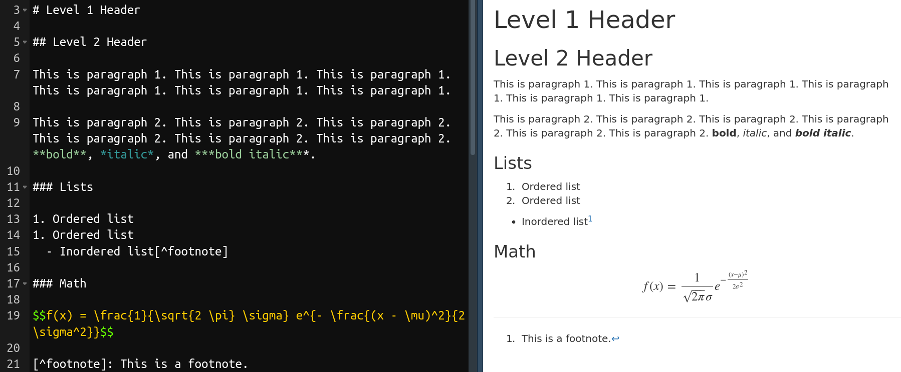

# Overview of R Markdown

## A Brief Introduction

"Markdown" is a minimalist and easy-to-learn markup language[^markup], which formats the text by using simple plain text markers, such as `#`, `-`, and `*`. The syntax of Markdown is shown in figure \@ref(fig:md-demo).

(ref:mddemo) A demonstration of Markdown synatax. The left is the text content with markdown syntax. The right is the formatted document based on Markdown syntax.

```{r md-demo, fig.cap="(ref:mddemo)", out.width="100%"}

```

"R Markdown", as it's name implies, combine R and Markdown, which enables users to embed computed results in a document written with Markdown syntax. In addition, R Markdown uses *Pandoc Markdown*[^pandoc], an enhanced version of Markdown that includes more versatile syntax,
such as syntax for citations, footnotes, and tables. The R package *bookdown* [@xie2016] further expands R Markdown's ability, allowing authoring documents with publication-ready qualities.


## Benefits of Using R Markdown

There are several benefits for using R Markdown as an authoring tool. Most of them results directly from the extensibilty of R, the language R Markdown bases on.

### R

R is a programming language developed not in a traditional CS[^cs]-context but for the purpose of statistical computing [@rcoreteam2018]. This makes R a special language -- althought R has a steep learning curve compared to other GUI-based statistical softwares, it has a gentle learning curve compared to other "hardcore" programming languages. R is designed for scientists, not programmers.
In addition, there is a huge and friendly community support for R, which means solutions to many problems new users often face can easily be found on the web.

Many fields other than Statistics either start to or already use R substantially, such as Biostatistics and Bioinformatics, Ecology and Evolution, Finance, Psychometrics, Geospatial analysis, and even Linguitics [@cran2018a]. This is due to R's great extendibility, with more than 13,000 packages hosted on @cran2018. As noted later, this extandibility also enables turning R Markdown into a specialized tool for authoring in Linguistics.

By integration with R language, R Markdown allows computed results be directly embedded into the document.
To put it another way, the analysis of data (through R) is directly integrated into document writing, and hence, errors incured by manual copy-and-pasting are eliminated. This also enhance the *reproduciblity* of the workflow [@baumer2014], since every time the document is generated from R Markdown, the underlying code for data analysis is rerun to generate the embedded output. Generating the document is essentially reproducing the analysis of data.


(ref:rmddemo) A demonstration of R Markdown. The left is the source of R Markdown file. The right is the document generated from R Markdown.

```{r rmd-demo, fig.cap="(ref:rmddemo)", out.width="100%"}

```


### Supporting Reproducibility

A reproducibile analysis is an analysis with results that can be reproduced from raw data anywhere by anybody [@berez-kroeker2018]. 
The nature of R, a programming language, lends itself to facilitating reproducibility, since writing down the analysis as *code* is essentially *recording every step of the analysis*.
Besides integration with R, two other features make R Markdown a good tool facilitating a reproducible workflow:

1. **R Markdown is plain text**  
  Plain text format, contrary to binary files such as MS Word, doesn't require specialied and propriety software to read. People with no access to propriety softwares can still open and read the file, hence facilitates the openness of science.  
  `r cond_cmpl("<br>", "\\newline")`
  Plain text format also makes the file easiler to "version control", i.e, keeping track of the history of modifications, or versions, of the file by version control softwares. Although not directly related to reproducibility, recording the history of modification protects the file against unanticipated errors that can break down the workflow, since one can always revert to previous versions of the version controled file.

1. **Python support**  
  The new R package *reticulate* [@allaire2018] enhances the interoperability between Python and R in an R environment. It is now possible to run Python in R console. The new Python engine enabled by reticulate also solved a major drawback in previous versions of R Markdown -- Python variables couldn't be shared across different code chunks. Now, Python code chunks share states in R Markdown and variables constructed in previous code chunks can be accessed, using either Python or R code. This gives R Markdown similar, if not better, power compared to Juyper notebook.  
  `r cond_cmpl("<br>", "\\newline")`
  Integrating R and Python is especially important for Linguistics, as many actively developed packages and libraries for Linguistics are written in Python. For example, the famous software for analying speech sound, Praat [@boersma2002], has a third-party support in Python, which allows accessing low-level functions in Praat using Python syntax [@jadoul2018] instead of using the less popular Praat scripting.  
  `r cond_cmpl("<br>", "\\newline")`
  Some tasks that R certainly does better than Python are data manipulation, statistical analysis, visualization, and report generation. Hence, integrating R and Python combines the strengths of both languages. An analysis can be done in R, Python, or both. R Markdown can then act as a "glue", combining different parts of analysis together into an integrated and reproducible whole.

### Easy Collaboration

When multiple authors need to work on the same document, it can become hard to manage the document. Things become easy when R Markdown is used.
In cases where authors work on their own resposible sections of the document, each author can write her sections in a standalone R Markdown file. By using R Markdown's "child document" functionality[^child], one can then combine multiple R Markdown files into a single file for document generation.

In cases where multiple authors need to work on the same section or when one author often overwrites another author's text, the aforementioned version control system and a web-based hosting service for version control, such as GitHub, can be used. Version control systems, such as Git, can automatically merge changes contributed by different authors into the same file. If there are conflicts in the changes, such as when two authors modified the same line in the file, the conflicts are recorded by Git and are can be solved by manual effort.

### Wide Range of Output Formats and Styles

R Markdown supports a variety of output formats, owing to its foundation, *Pandoc* [@macfarlane2013]. Some of the supported formats are MS Word, MS Powerpoint, LaTeX, PDF, and HTML. There are also multiple styles of document, such as slides, books [@xie2016], journal papers, and even websites or blogs [@xie2017].
This large variety of output formats enables authors to publish their works through different formats with the same underlying R Markdown file.

#### HTML Support

It can be argued that the most prominent output format of R Markdown is HTML.
In the Digital Age, the web becomes a popular, if not dominant, way to distribute publications. Web pages enable displaying more varieties of contents, such as GIFs (animated figures) and tables with search bars, thus enhancing the ability to convey ideas.

With research becoming more complex, traditional medium might not be enought to present the results. For example, it might be useless to display a complex 3D graph in a static PDF. Using GIF, however, can facilitate the visualization of complex 3D graphs by using animation to rotate 3D objects in the graphs [@wilke2018].
Using HTML output thus enhances communication with the readers -- the explanatory text is written next to dynamic visual elements, rather than links to external files or web pages.

Using HTML outputs also enables authors to self-publish the content through the web, making resources available to a wider audience. This is especially useful for educational purposes.


## Making R Markdown Suitable for Linguistics

The power of R Markdown as an authoring tool that facilitates an integrated workflow in Linguistics comes from R's extendiblity.
By using R extensions, or R packages, R Markdown can be turned into a specialized tool for writing Linguistics-related documents. Below introduces several examples that reduce the burden of writing Linguistics-related documents in R Markdown.

### Bibliographies and Citations

It is necessary to include citations for academic writing, and many use EndNote, a reference management software, together with MS Word to accomplish this task. R Markdown has native support for inserting and formating citations and bibliographies, using a citation syntax provided by *Pandoc* [@rstudio2018]. With R's extendibility, the experience of inserting citations can become much more comfortable. For example, the R package *citr* [@aust2017] lets authors insert citations through a graphical interface, where authors can search information (author, year, title, etc.) about the articles they want to insert. This extension makes the experience of inserting citations and references in R Markdown similar to that of using EndNote with MS Word.
*citr* integrates well with *Zotero*[^zo], a free and open-source reference management software similar to EndNote. The citation and bibliography format is automatically styled based on the provided csl file[^csl].

(ref:citr) Using citr with R Markdown.

```{r fig.cap="(ref:citr)"}
if (is_html_output()) include_graphics("figs/citr.gif")
```

```{r fig.show='hold', out.width=c("42.5%", "55.5%"), fig.cap="(ref:citr)"}
if (is_latex_output()) include_graphics(c("figs/citr2.png", "figs/citr0.png"))
```

### linguisticsdown

*linguisticsdown* is an R package developed by the author of this article to support Linguistics-related doucument writing in R Markdown [@liao2018]. Currently, the package provides graphical interface as well as functions to facilitate writing IPA symbols in R Markdown.

Problem often arise when inserting IPA symbols into documents, since there is no simple way to type IPA symbols with the keyboard. 
*linguisticsdown* makes it possible to type IPA symbols by searching their phonetic descriptions, such as "plosive", "bilabial", "aspirated" etc., or by using the X-SAMPA input method [@wells1995]. With this extension, authors can write documents containing IPA symbols with ease.

(ref:lingdown) Using linguisticsdown with R Markdown.

```{r fig.cap="(ref:lingdown)"}
if (is_html_output()) include_graphics("figs/ipa.gif")
```

```{r out.width="80%", fig.cap="(ref:lingdown)"}
if (is_latex_output()) include_graphics("figs/ipa.png")
```

### Using Templates

As suggested previously, R Markdown can output formats meeting the requirements of journal submission. Authors can thus write documents with the simple R Markdown syntax without worrying about the typesetting.
Currently, officially supported journal templates[^paper] are mostly journals under big publishers such as Elseiver, Springer, and SAGE.
The range of support can be extended, however, as long as LaTeX templates are provided. For example, *thesisdown* [@ismay2018] provide an R Markdown template for writing thesis at Reed College, and several other thesis templates based on *thesisdown* modified it to fit their institutions' needs.


[^pandoc]: https://pandoc.org/MANUAL.html#pandocs-markdown

[^markup]: Markup languages are used to style text appearance. For example, HTML (Hyper Text Markup Language) is one of the most popular markup language, which is used to format web pages.

[^cs]: Abbreviation of "Computer science".

[^paper]: For a list of supportted journal templates, see https://github.com/rstudio/rticles.

[^zo]: https://www.zotero.org/

[^csl]: Citation Style Language. See https://citationstyles.org/ for details. For supported citation formats, see https://github.com/citation-style-language/styles.

[^child]: https://yihui.name/knitr/demo/child/