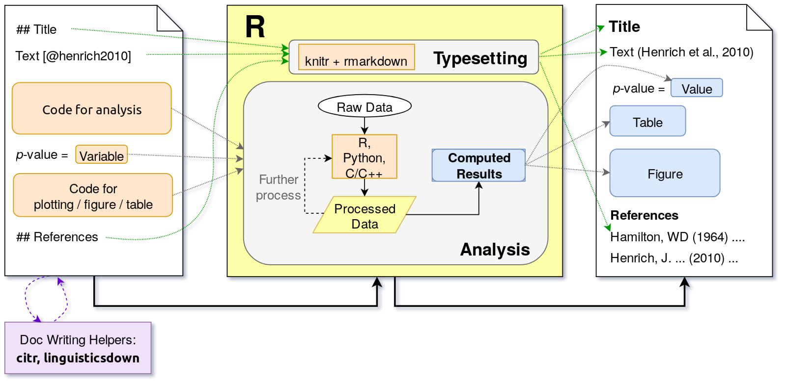

# A Proposed Workflow

```{r}
txt <- "r p_val"
tk <- '`'
```

Figure \@ref(fig:rmd-flow) illustrates the flow of text (for readers) and data (for analysis) processing in R Markdown.
Based on figure \@ref(fig:rmd-flow), authors can do the following to achieve an integrated workflow and don't need to navigate around several softwares during authoring:

1. Put R or Python code that clean, manipulate, and analyze data in the R Markdown source file. If there are too many code, put them in separated R or Python scripts and include them into R Markdown by using "source functions".
For even more complex analyses, use the structure of *R Package* as a basis for project management, in which documentation of data sets and functions[^fc], raw data, and reports can be put together into a well-structured package [@flight2014; @wickham2015].

1. Put R code that generate figures or tables in the R Markdown source file, making it easy to see how they were generated.

1. For values that can be computed from data and needed to be included as inline text in the document, save them as R variables and put them inline with special syntax. For example, use *p*-value = \``r txt`\`. The variable `p_val` will be converted to the value when the output document is generated. Hence, when data changes (e.g. addition of new data) or the analysis code are modified, the value of the variable `p_val` gets automatically updated as well.

1. Use citr to search and insert citations. citr integrates well with Zotero[^zo], a free and open-source reference management software similar to EndNote. The citation and bibliography format is automatically styled based on the provided csl file[^csl].

1. Use linguisticsdown to type IPA symbols.


(ref:rmdflow) Combining R's data analysis and typesetting abilities to generate a reproducible report. `r cond_cmpl("<br>", "\\newline")` The leftmost is a representation of an R Markdown source file; the rightmost is a generated document. The middle is the process underlying the conversion from source file to output document. For documents with complete template support, the typesetting is automated, so authors only need to focus on analysis and contents of the article.

```{r rmd-flow, fig.cap="(ref:rmdflow)", out.width="100%"}

```


[^fc]: For complex analyses, there are often long and repetitive code. Wraping these redundant code into functions can make the analyses more manageble.

[^pkg]: Every one with R installed on the computer can dowload (if made available) and load the package, rerun analysis written in R Markdown, read the documentation of the data sets, and even read the source code of the analysis functions.

[^zo]: https://www.zotero.org/

[^csl]: Citation Style Language. See https://citationstyles.org/ for details.